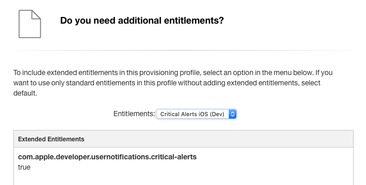

Critical Alerts is a new type of opt-in notifications in iOS 12 and watchOS 5.0, that allows to bypass "Do Not Disturb" and the mute switch. Because of this, it's obvious that not all apps can send these new type of notifications.

We recently integrated this new feature in [Safy](https://wwww.safy.bz), an app for volunteer firefighters in South Tyrol, Italy. This rural area has many secluded mountain villages and also a long history of volunteer work. Safy uses push notifications to inform volunteers about nearby emergencies (fires, floods, car accidents, ...).

In this post we will explore which apps qualify for Critical Alerts and how you can implement them. All following examples are based on Xcode 10.0 and Swift 4.2.

### Critical Alerts are not meant for every app

Apple already [denies](https://developer.apple.com/app-store/review/guidelines/#apple-sites-and-services) sending marketing information via push (and we also know some apps break this rule), so I guess, the last what they want is another, much more intrusive way to annoy users. Because of this, these type of notification is limited for medical or health related apps, public safety or special security apps. They should also only be used for *critical events*, which required the *immediate* attention of the user. If you develop a game, you most certainly do not need this! 😅

### Ask for permission

As a first step, you need to request a special entitlement for your app. You should do this via a [dedicated form on Apple's developer web page](https://developer.apple.com/contact/request/notifications-critical-alerts-entitlement/).

In the form, you're required to explain what your app is doing and how you plan to us Critical Alerts. It's obvious that Apple expects you to list a compelling reason why your app might need the immediate attention of the user.

In our case, we described our app and emphasized that the emergencies we are broadcasting are usually very time sensitive. It is critical that firefighters are informed as soon as possible, every minute counts in some situations. After 3 weeks waiting time, we received a positive answer from Apple via email!

### New provisioning profiles

After receiving the approval from Apple, you need to create 2 dedicated provisioning profiles (development and distribution) that include the additional entitlement. Head to the *Certificates, Identifiers & Profiles* section of your [developer account](https://developer.apple.com/account) and create a new development provisioning profile for your app. As last step in the process, you should see a screen that allows you to add additional entitlements. Select *Critical Alerts* from the dropdown and you're good to go!

Perform the same steps for your new distribution provisioning profile.



### Time to play with Xcode

Now it's time to dive into the code part. As a first step, you need to switch off *Automatic Code Signing* (if you're using it) and select the provisioning profiles that you've just created manually under the *Signing (Debug)* and *Signing (Release)* sections in your target.

Second, you need to request the user permission for Critical Alerts. Apple added a [new key]("https://developer.apple.com/documentation/usernotifications/unnotificationsettings/2963116-criticalalertsetting?language=swift") for this in the *UNAuthorizationOptions* enum. If you're still supporting iOS 11.x or older, don't forget to check if this option is available:

```swift
func requestAuthorization(completion: ((Bool, Error?) -&gt; Void)?) {
    let options: UNAuthorizationOptions
        
    if #available(iOS 12.0, *) {
        options = [.alert, .badge, .sound, .criticalAlert]
    } else {
        options = [.alert, .badge, .sound]
    }

    UNUserNotificationCenter.current().requestAuthorization(options: options) { (granted, error) in
        completion?(granted, error)
    }
}
```

The third step is a bit weird, because Xcode 10.0 does not (yet?) display Critical Alerts like all other optional capabilities under the *Capabilities* tab. Therefore, you need to manually edit your *Entitlements* file and add the ***com.apple.developer.usernotifications.critical-alerts*** key with boolean value ***YES*** to it.

The critical option, triggers a new system alert that asks the user to enable Critical Alerts. Keep in mind that users can always deny your request or change their mind and disable them in the Settings app, just like for usual notifications.

As a future improvement, I would like to see this alert combined with the default notification alert. Showing two permission alerts in a row, just to enable all supported notification types, can be confusing to the user. I hope Apple changes this in a future iOS version.

### Let's try this out
As a last step, you need modify the APS payload when sending push notifications from your server. If you want a notification to be critical, add the following object for the sound key in the APS payload:

```json
{  
    "aps":{  
        "alert": "This is a Critical Alert!",
        "badge":1,
        "sound":{  
          "critical":1,
          "name":"your_custom_sound.aiff",
          "volume":1.0
        }
     }
}
```

You need to set 1 for the critical key, add a custom sound file (.aiff format) and specify the device volume (values 0.0 to 1.0), where 1.0 means full volume.  More information about these new keys can be found in Apple's [Generating a Remote Notification](https://developer.apple.com/documentation/usernotifications/setting_up_a_remote_notification_server/generating_a_remote_notification?language=swift) article.

Please keep in mind that, even if your app can send Critical Alerts, not all notifications need to be necessarily critical. Use your new power wisely! 🧙‍♂️